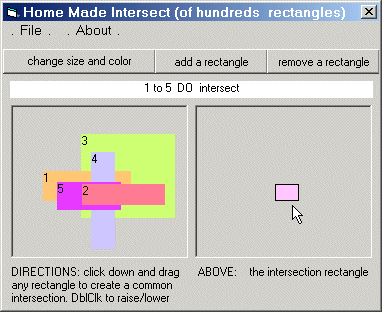



## Intersection of HUNDREDS rectangles, no API\!

### Description

Curious of how to get the intersection of hundreds rectangles almost instantly

and with no API? Then come and see!...

Arabian and italian algorithms in play!

----

This little demo shows live intersection of 2 up to hundreds rectangles.

It produces: A) a boolean indicating whether all rectangles intersect

B) the intersection rectangle itself

The homemade method for finding the intersection rectangle (in 'IntersectHomeMade' function)

is mine and consists of defining all (2*number of rectangles)^2 intersection points (both real

and virtual) and then filtering them to find the only 4 points belonging to all rectangles.

A very unusual way, isn't?

In the same routine, the method for finding whether or not the 2 rectangles intersect (boolean

value) is not fully mine but derived by a recent post on the planet: 'Knowing whether two

objects intersect' (by Tarek Said, level Intermediate, Coding Standards, submitted august 12 2K1).

I hope yow like the effort, have fun :)
 
### More Info
 

             |
---                |---
**Submitted On**   |2001-08-15 15:00:36
**By**             |[pietro ing\. cecchi](https://github.com/Planet-Source-Code/PSCIndex/blob/master/ByAuthor/pietro-ing-cecchi.md)
**Level**          |Advanced
**User Rating**    |3.7 (11 globes from 3 users)
**Compatibility**  |VB 6\.0
**Category**       |[Math/ Dates](https://github.com/Planet-Source-Code/PSCIndex/blob/master/ByCategory/math-dates__1-37.md)
**World**          |[Visual Basic](https://github.com/Planet-Source-Code/PSCIndex/blob/master/ByWorld/visual-basic.md)
**Archive File**   |[Intersecti248818182001\.zip](https://github.com/Planet-Source-Code/pietro-ing-cecchi-intersection-of-hundreds-rectangles-no-api__1-26336/archive/master.zip)

